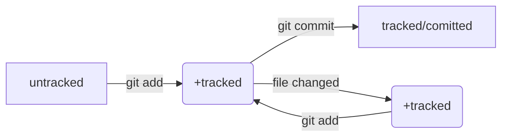

# Что такое Git?

**Система контроля версий (англ. Version Control System, или коротко VCS)** - <br>
программа, кот хранит историю итераций проектов; <br>
это программное обеспечение, которое помогает отслеживать изменения <br>
в программах, текстовых файлах, больших документах, веб-сайтах и так далее. <br>
Для обозначения систем контроля версий используют не только аббревиатуру **VCS** <br>
но и **SCM** (от англ. Source Control Management — «система управления исходным кодом»). 

Одно изменение или группу изменений в VCS называют **ревизией** или **версией**. <br>
Каждая такая ревизия содержит информацию о том, что изменилось, кто внёс <br>
изменения, когда это было и иногда комментарии к изменению. <br>


#### Основные функции системы контроля версий:
* хранит историю изменений в виде отдельных ревизий;
* позволяет манипулировать историей: <br>
например, менять порядок ревизий, полностью удалять версии, <br>
возвращаться назад в истории;
* помогает анализировать изменения: <br>
например, кто и когда вносит изменения, кто чаще всего вносит изменения в определённый файл и т.д.


# Установка командной строки (Git Bash) для пользователей Windows

Если вы пользователь macOS или Linux — командная строка у вас уже установлена. <br>
Но если ваш компьютер работает на базе Windows, вам понадобится установить командную строку вручную. 

Есть несколько способов установки. Мы рекомендуем пакет **Git for Windows**. <br>
Для установки пакета: <br>
1. Перейдите на эту [страницу официального сайта Git](https://git-scm.com/download/win)  
2. Скачайте одну из двух версий из категории Standalone Installer  
Узнать тип вашей системы Windows можно в настройках.  
3. Запустите программу установки. Обратите внимание, куда будет установлен Git.  
Обычно это директория **C:\Program Files\Git**.
4. Проверьте, что в списке устанавливаемых программ стоит галочка напротив пункта  
**Git Bash Here** — это позволит открывать консоль с Git в любой папке.
5. Далее установщик предложит много опций. Оставляем все как есть - жмем Next несколько раз  
6. После окончания установки нажмите Finish 


#### Первый запуск Git Bash
Запустите программу Git Bash. Сделать это можно двумя способами.  
Можно ввести название программы в окно поиска на панели задач.

 
А можно открыть директорию, в которую был установлен Git.  
Обычно это директория C:\Program Files\Git\bin.  
Перейдите в bin и запустите файл bash.exe.  
Откроется консоль.Вместо USER_NAME будет указано ваше имя пользователя,   
а вместо HOST_NAME — имя компьютера.    
Если вы видите консоль, значит, установка прошла успешно.


# Git. Установка и настройка macOS|Linux

*Если вы пользователь Windows, то Git у вас уже есть.  
Вы установили его в составе пакета Git for Windows вместе с командной строкой.
Убедитесь в этом. Откройте консоль и выполните команду **$ git version**.  
Если Git установлен правильно, консоль выведет его текущую версию.*


### macOS
1. Откройте консоль и выполните команду /usr/bin/git. Она запустит установщик 
2. Нажмите Install и дождитесь окончания установки
3. Когда установка завершится, для проверки выполните команду $ git version.  
Если на экран выводится текущая версия Git, значит, установка прошла успешно.

### Linux
1. Найдите программу Terminal в поиске или в списке программ.
2. Перейдите на [официальный сайт Git](https://git-scm.com/download/linux)
3. Выберите команду установки для своей версии Linux.
4. Скопируйте её в программу Terminal и нажмите Enter. 
5. Введите команду для проверки **$ git version**
6. Если вы видите в консоли текущую версию Git, всё прошло успешно.


# Настройка Git

Для настройки Git можно использовать командную строку —  
теперь вы умеете работать с ней.  
Если у вас macOS или Linux, запустите программу Terminal. Если Windows — Git Bash.

### Работа с файлом настройки .gitconfig

Сейчас вы работаете в одиночку, но в дальнейшем вам может понадобиться использовать Git в команде.  
Чтобы участникам проекта было понятно, кто и какие изменения вносил,  
нужно представиться и указать имя пользователя и адрес электронной почты.
Для этого введите в консоль эти команды:


```bash
$ git config --global user.name "User Namovich" 
# имя или ник нужно написать латиницей и в кавычках

$ git config --global user.email username@yandex.ru
# здесь нужно указать свой настоящий email
```

Все глобальные настройки Git хранит в файле .gitconfig в домашней директории.  
Команда запишет в этот файл указанные имя и почту.  
Чтобы убедиться в этом, можно вызвать команду для чтения файлов **$ cat ~/.gitconfig**.  
Другой способ проверки **$ git config --list** - выводит содержимое файла кофигурации Git  
В ответ командная строка покажет текущие значения настроек:  
**user.name=Username**   
**user.email=username@yandex.ru**  


# Базовые команды в консоли

## Навигация 
* pwd  — покажи, в какой я папке;
* ls — покажи файлы и папки в текущей папке;
* ls -a — покажи также скрытые файлы и папки, названия которых начинаются с символа .;
* cd first-project — перейди в папку first-project;
* cd first-project/html — перейди в папку html, которая находится в папке first-project;
* cd .. — перейди на уровень выше, в родительскую папку;
* cd ~ — перейди в домашнюю директорию (/Users/Username);
* cd / — перейди в корневую директорию.

## Работа с файлами и папками
### Создание
* touch index.html — создай файл index.html в текущей папке;
* touch index.html style.css script.js — если нужно создать сразу несколько файлов,  
можно напечатать их имена в одну строку через пробел;
* mkdir second-project — создай папку с именем second-project в текущей папке.

### Копирование и перемещение
* cp file.txt ~/my-dir — скопируй файл в другое место;
* mv file.txt ~/my-dir — перемести файл или папку в другое место.

### Чтение
* cat file.txt — распечатай содержимое текстового файла file.txt. Работает только с текстовыми файлами!

### Удаление
* rm about.html — удали файл about.html;
* rmdir images — удали папку images;
* rm -r second-project — удали папку second-project и всё, что она содержит.

### Полезные возможности
* Команды необязательно печатать и выполнять по очереди. Можно указать их списком —  
разделить двумя амперсандами (&&).
* У консоли есть собственная память — буфер с несколькими последними командами.  
По ним можно перемещаться с помощью клавиш со стрелками вверх (↑) и вниз (↓).
* Чтобы не вводить название файла или папки полностью, можно набрать первые символы имени и дважды нажать Tab.  
Если файл или папка есть в текущей директории, командная строка допишет путь сама.

# Инициализируем репозиторий
Сделать папку репозиторием — **git init**
Cоздайте папку first-project и сделайте её Git-репозиторием:  
перейдите в неё с помощью команды **cd** и выполните **git init**. 

 
```bash
$ cd ~/dev/first-project # перешли в нужную папку

$ git init # создали репозиторий
```

*! Помните, что не рекомендуется создавать репозиторий Git внутри другого Git-репозитория.  
Это может вызывать проблемы с отслеживанием изменений.*

###«Разгитить» папку, если что-то пошло не так, — rm -rf .git 
Если вы случайно сделали Git-репозиторием не ту папку, её можно «разгитить».  
Для этого нужно удалить скрытую подпапку **.git**.  


```bash
$ cd <папка с репозиторием> # перешли в папку

$ rm -rf .git # удалили подпапку .git
```

*! Будьте осторожны: в подпапке .git хранится история изменений.  
Если удалить .git, то вся история проекта будет стёрта без возможности восстановления —  
останется только последняя версия файлов.*

# Проверить состояние репозитория — git status

После инициализации репозитория запустите команду **git status**  
Она показывает текущее состояние репозитория.

# Добавляем файлы в репозиторий

1. Создайте файл в репозитории с помощью touch  
```bash
$ touch todo.txt
$ touch readme.txt
# создали файлы todo.txt и readme.txt

$ git status # проверили статус
```
2. Сейчас в first-project два файла. Мы хотим отслеживать состояние обоих,  
поэтому можем использовать команду **git add --all**  
```bash
$ git add --all # подготовили к сохранению все файлы в репозитории
$ git status # проверили статус
```
3. Добавлять файлы можно и по одному, без ключа --all.
```bash
$ git add todo.txt
$ git add readme.txt
$ git status
```
4. Также можно добавить текущую папку целиком:  
```bash
$ git add . # добавить всю текущую папку
$ git status
```

Получилось! Файлы, которые отмечены зелёным, теперь отслеживаются и готовы к сохранению.  
Но сохранения пока не произошло, потому что команда git add  
только запоминает текущее содержимое (контент) файла.

# Делаем первый коммит

**Коммит** — это одна из основных сущностей в Git (и в других системах контроля версий).  
Коммит гарантирует, что изменения будут сохранены в истории  
и при необходимости к ним можно будет «откатиться».  
Это как если бы вы могли выполнить операцию Ctrl+Z для целой папки (репозитория).  

**Выполнить коммит — git commit -m 'Сообщение с описанием внесенных изменений в кавычках'.**  

```bash
$ git commit -m 'Мой первый коммит!'
```

# Просмотреть историю коммитов — git log

Чтобы увидеть историю коммитов, введите команду **git log**  
Обратите внимание, что по умолчанию git log выводит коммиты в обратном хронологическом порядке —  
последние коммиты оказываются первыми сверху.  
В этом можно убедиться, если посмотреть на дату и время их создания.  
Нажать клавишу **Q** в английской раскладке - выйти из просмотра истории


# Что такое SSH?

Когда компьютеры обмениваются данными в сети, они следуют сетевым протоколам —  
правилам обмена данными между компьютерами.
Один из наиболее распространённых сетевых протоколов — **SSH(Secure Shell Protocol)**
С помощью этого протокола можно получать данные с удалённого компьютера или отправлять их на него.  
Трафик шифруется, поэтому протокол безопасен.

**SSH использует пару ключей для обеспечения безопасности — публичный и приватный:**  
* Приватный ключ (private key) хранится только на вашем компьютере и не должен передаваться кому-либо ещё.  
Он используется для расшифровки данных.
Публичный ключ (public key) доступен всем и используется для шифрования данных.  
Они могут быть расшифрованы парным приватным ключом.

# Проверка наличия SSH-ключа

Прежде чем генерировать SSH-ключи, убедитесь, что у вас их ещё нет.  
По умолчанию директория с SSH-ключами находится в домашней директории пользователя. Перейдите в неё.


```bash
$ cd ~ # перешли в домашнюю директорию
```

Обычно SSH-ключи находятся в директории .ssh/.  
Проверить наличие этой директории и файлов в ней можно с помощью следующей команды.

```bash
$ ls -la .ssh/ # вывели список созданных ключей
```

Если папка пустая или её нет, всё в порядке.   
Если есть файлы с похожими названиями, SSH-ключи уже создавались:
* id_dsa.pub;
* id_ecdsa.pub;
* id_ed25519.pub;
* id_rsa.pub.

Если вы не создавали эти файлы, удалите их все.  

# Инструкция по генерации SSH-ключа

1. Для генерации SSH-пары можно использовать программу ssh-keygen.  
Откройте терминал и введите следующую команду.

```bash
$ ssh-keygen -t ed25519 -C "электронная почта, к которой привязан ваш аккаунт на GitHub"
```

Если вы видите сообщение об ошибке, то, скорее всего,  
ваша система не поддерживает алгоритм шифрования ed25519.  
Ничего страшного: используйте другой алгоритм.  

```bash
$ ssh-keygen -t rsa -b 4096 -C "электронная почта, к которой привязан ваш аккаунт на GitHub"
```

После ввода отобразится такое сообщение.  
> Generating public/private rsa key pair. # сгенерированы публичный и приватный ключи  

2. Укажите место хранения ключей.  
Простой вариант — сделать домашний каталог пользователя путём по умолчанию.  
Для этого нажмите Enter.


**macOS**  
> Enter a file in which to save the key (/Users/you/.ssh/id_rsa): [Press enter]

 
**Windows**  
> Enter a file in which to save the key (C:\Users\<имя_пользователя>\.ssh\):[Press enter]

3. Программа запросит кодовую фразу (passphrase) для доступа к SSH-ключу.  
Вы можете оставить поле пустым. Для этого нажмите Enter, а затем ещё раз Enter для подтверждения.  

> Enter passphrase (empty for no passphrase): [Type a passphrase]
> Enter same passphrase again: [Type passphrase again]


4. Готово! Теперь осталось проверить, что ключи действительно сгенерировались.  
Для этого вызовите команду **ls -a ~/.ssh**  

На экране должны появиться два файла — один с расширением .pub, другой — без.  
Файл в .pub — **публичный**, им можно делиться с веб-сайтами или коллегами.  
**Файл без расширения .pub — приватный. Ни в коем случае не передавайте его никому!**


# GitHub. Знакомство, регистрация
* GitHub платформа для размещения удалённых репозиториев;
* принадлежит компании Microsoft

###Регистрация
1. В правом верхнем углу [главной страницы GitHub](https://github.com/) нажмите на Sign up 
2. Введите адрес электронной почты (Enter your email)
3. Придумайте пароль (Create a password)
4. Введите имя пользователя (Enter a username)
5. Платформа спросит, хотите ли вы получать на почту рассылку с обновлениями и новостями  
(Would you like to receive product updates and announcements via email?).  
Введите y, если хотите получать рассылку, или n, если не хотите.
6. Нажмите кнопку Continue 
7. GitHub предложит вам пройти капчу. Сделайте это.
8. После прохождения капчи нажмите Create account (англ. «создать аккаунт»).
9. Введите короткий код, который будет отправлен на указанный вами почтовый адрес.


# Создаём удалённый репозиторий

1. Зайдите в свой профиль по ссылке https://github.com/username,  
где username — имя, которое вы указали при регистрации.
2. Создайте репозиторий. Для этого перейдите на вкладку Repositories,  
а затем нажмите на зелёную кнопку New справа.
3.Открылось окно создания нового репозитория. Назовите его.  
Название удалённого репозитория необязательно должно совпадать с именем папки проекта у вас на компьютере.  
Но чтобы не путаться, будем называть их одинаково. Другие поля вам пока не понадобятся.  
Нажимайте на зелёную кнопку **Create repository** внизу.
4. Готово! Удалённый репозиторий создан. Страница с ним открывается автоматически.  
5. Осталось связать удалённый репозиторий с локальным, который уже есть на вашем компьютере. 

# Привязываем SSH-ключ к GitHub

1. После выполнения команды ssh-keygen в директории ~/.ssh будет создано два файла —  id_ed25519 и id_ed25519.pub  
(или id_rsa и id_rsa.pub — в зависимости от того, какой алгоритм вы использовали):
* id_ed25519/id_rsa — приватный ключ (файл без .pub в конце). Ни в коем случае не копируйте его и не делитесь им.
* id_ed25519.pub/id_rsa.pub — публичный ключ (на это указывает расширение .pub).  
2. Скопируйте содержимое файла с публичным ключом в буфер обмена.  

**macOS**


```bash
# скопировать содержимое ключа в буфер обмена:
$ pbcopy < ~/.ssh/id_rsa.pub
# для ed25519:
$ pbcopy < ~/.ssh/id_ed25519.pub
```

В качестве альтернативы вы можете распечатать файл на экран с помощью cat ~/.ssh/id_rsa.pub  
и скопировать его вручную

**Windows**  

```bash
# скопировать содержимое ключа в буфер обмена:
$ clip < ~/.ssh/id_rsa.pub
# для ed25519:
$ clip < ~/.ssh/id_ed25519.pub
```

Если clip не сработает, выведите содержимое файла с помощью  
cat ~/.ssh/id_rsa.pub или cat ~/.ssh/id_ed25519.pub  
и скопируйте вывод в буфер обмена из консоли.


2. Перейдите на GitHub и выберите пункт Settings в меню аккаунта
3. В меню слева нажмите на пункт SSH and GPG keys
4. В открывшейся вкладке выберите New SSH key
5. В поле Title напишите название ключа. Например, Personal key (англ. «личный ключ»)
6. В поле Key type должно быть Authentication
7. В поле Key скопируйте ваш ключ из буфера обмена
8. Нажмите на кнопку Add SSH key
9. Проверьте правильность ключа с помощью следующей команды **ssh -T git@github.com**

Если это первый раз, когда вы используете Git, чтобы поделиться проектом на GitHub,  
появится похожее предупреждение.

The authenticity of host 'github.com (140.82.121.4)' can't be established.  
ED25519 key fingerprint is SHA256:+DiY3wvvV6TuJJhbpZisF/zLDA0zPMSvHdkr4UvCOqU.  
This key is not known by any other names.  
Are you sure you want to continue connecting (yes/no/[fingerprint])?

Это предупреждение сообщает, что вы никогда не соединялись с сервером GitHub.  
Поэтому Git не может гарантировать, что сервер является тем, за кого он себя выдаёт.  
Для подтверждения подлинности сервер генерирует и публикует ключи SHA256.  
Вы можете проверить ключи GitHub по [этой ссылке](https://docs.github.com/en/authentication/keeping-your-account-and-data-secure/githubs-ssh-key-fingerprints) 
Если ключ в предупреждении совпадает с тем, что вы видите на сайте, значит, сервер является действительным.


Введите yes, чтобы продолжить. Вы увидите приветствие на экране.  
Hi %ВАШ_АККАУНТ%! You've successfully authenticated, but GitHub does not provide shell access.

# Привязать удалённый репозиторий к локальному — git remote add

1. Перейдите на страницу удалённого репозитория, выберите тип SSH и скопируйте URL.  
Кнопка справа позволит сделать это мгновенно.
2. Откройте консоль, перейдите в каталог локального репозитория и введите команду git remote add  
Эта команда принимает имя удалённого репозитория (или псевдоним origin) и его адрес.

```bash
$ cd ~/dev/first-project
$ git remote add origin git@github.com:%ИМЯ_АККАУНТА%/first-project.git
```
3. Убедиться, что репозитории связаны, — **git remote -v**

```bash
$ git remote -v
origin    git@github.com:%ИМЯ_АККАУНТА%/%ИМЯ-ПРОЕКТА%.git (fetch)
origin    git@github.com:%ИМЯ_АККАУНТА%/%ИМЯ-ПРОЕКТА%.git (push)
```

# Синхронизируем локальный и удалённый репозитории

1. Отправить изменения на удалённый репозиторий — git push  
В первый раз эту команду нужно вызвать с флагом -u и  
параметрами origin (имя удалённого репозитория) и main или master (название текущей ветки).  
Флаг -u свяжет локальную ветку с одноимённой удалённой.


```bash
$ git push -u origin main # Если команда приведёт к ошибке, попробуйте 
                          # заменить main на master.
```

2. Если вы указывали кодовую фразу при настройке SSH-ключей, её нужно будет ввести.  
3. Зайдите в репозиторий first-project на GitHub. Вы увидите, что в репозитории появились файлы с изменениями.
4. В дальнейшем при работе с удалённым репозиторием флаг -u можно опустить и писать просто git push.

# Файл README.md 

Чтобы другие пользователи, а также потенциальные клиенты или работодатели могли понять,  
что представляет собой проект, его нужно описать. Такое описание принято указывать в файле README.md  
Вот пример файла README.md для Git на [GitHub](https://github.com/git/git/blob/master/README.md)  
README.md — текстовый файл, который можно создать командой touch,    
а затем редактировать так же, как и любой другой текстовый документ. Например, в блокноте.  
Преимущество README.md в том, что средства командной работы (такие, как GitHub)  
могут отображать его содержимое в браузере в виде удобной разметки.  
Для этого нужно не просто залить текст, но и настроить шрифт, заголовки и отступы с помощью markdown.  
**Маркда́ун** — это специальный язык разметки. Он позволяет красиво отформатировать текстовый документ. 
Загляните в руководства по маркдауну — например, в [шпаргалку на GitHub](https://gist.github.com/fomvasss/8dd8cd7f88c67a4e3727f9d39224a84c) или в [этот гайд] (https://www.markdownguide.org/cheat-sheet/). 


# Хеш — идентификатор коммита

В процессе работы с Git вам будет часто встречаться понятие **«хеш коммита»**.  
Эти странные строчки с бессмысленным (на первый взгляд) набором букв и цифр вы могли видеть,  
когда вызывали команду **git log** и выводили историю коммитов.

### Что такое хеш. Хеширование коммитов

**Хеширование** (от англ. hash, «рубить», «крошить», «мешанина») —  
это способ преобразовать набор данных и получить их «отпечаток» (fingerprint).


**Информация о коммите** — это набор данных:  
когда был сделан коммит, содержимое файлов в репозитории на момент коммита и ссылка на предыдущий,  
или родительский (parent), коммит.

Git **хеширует (преобразует)** информацию о коммите с помощью **алгоритма SHA-1** 
(Secure Hash Algorithm — «безопасный алгоритм хеширования»)  
и получает для каждого коммита свой **уникальный хеш** — результат хеширования.

Обычно **хеш** — это короткая (40 символов в случае SHA-1) строка, которая состоит <br>
из **цифр 0—9 и латинских букв A—F (неважно, заглавных или строчных)**. <br>
**Она обладает следующими важными свойствами**:
* если хеш получить дважды для одного и того же набора входных данных, то результат будет <br>
**гарантированно одинаковый**;
* если хоть что-то в исходных данных поменяется (хотя бы один символ), то хеш тоже изменится (причём сильно).

Чтобы убедиться в этом, можно поэкспериментировать с SHA-1 [на этом сайте](https://emn178.github.io/online-tools/sha1.html) <br>
Попробуйте ввести в поле input разные символы, слова или предложения и понаблюдайте,  
как меняется хеш в поле output.

### Хеш — основной идентификатор коммита

Git хранит таблицу соответствий хеш → информация о коммите.  
Если вы знаете хеш, вы можете узнать всё остальное:  
автора и дату коммита и содержимое закоммиченных файлов.  
Можно сказать, что **хеш — основной идентификатор коммита**.


При работе с Git хеши будут встречаться вам регулярно.  
Их можно будет передавать в качестве параметра разным Git-командам,  
чтобы указать, с каким коммитом нужно произвести то или иное действие.


Все **хеши** и **таблицу хеш → информация о коммите** Git сохраняет в **служебные файлы**.  
Они находятся в скрытой папке .git в репозитории проекта.


**Shortly**:
* Git преобразует информацию о коммитах с помощью алгоритма SHA-1  
и для каждого из них рассчитывает уникальный идентификатор — **хеш**.
* **Хеш** — основной идентификатор коммита и позволяет узнать его автора, дату и содержимое закоммиченных файлов.
* Все хеши, а также таблицу соответствий хеш → информация о коммите Git хранит **в папке .git**.


# Исследуем лог. Элементы описания коммита

**После вызова git log появляется список коммитов. Разберём элементы, из которых состоит описание**:  

* строка из цифр и латинских букв после слова commit — это **хеш коммита**;
* **Author** — имя автора и его электронная почта;
* **Date** — дата и время создания коммита;
* в конце находится **сообщение коммита**.

#### Получить сокращённый лог — git log --oneline

Получить сокращённый лог можно с помощью команды **git log с флагом --oneline** (англ. «одной строкой»).  
В терминале появятся только **первые несколько символов хеша каждого коммита и их комментарии**.  

**Сокращённый хеш** (то есть первые несколько символов полного) можно использовать точно так же, как и полный.  
Для этого команда **git log --oneline** автоматически подбирает такую длину сокращённых хешей,  
чтобы они были уникальными в пределах репозитория и Git всегда мог понять, о каком коммите идёт речь.

*Обратите внимание: если выход из просмотра логов не произошёл автоматически, нажмите клавишу **Q** 
(от англ. Quit — «выйти») в английской раскладке клавиатуры.*

**Самое важное в этом уроке:**
* Можно вызвать не только полный лог, но и сокращённый — это делается командой **git log --oneline**.
* В сокращённом логе выводятся **сокращённые хеши** — их можно использовать точно так же, как и полные.


# HEAD

При вызове команды git log вы также могли заметить надпись (HEAD -> master) после хеша одного из коммитов.  

**Файл HEAD** (англ. «голова», «головной») — один из служебных файлов папки .git.  
**Он указывает на коммит, который сделан последним** (то есть на самый новый).  
В этом можно убедиться с помощью терминала. Перейдите в папку .git командой cd.  
Посмотрите содержимое файла HEAD командой cat.  


```bash
$ pwd # посмотрели, где мы
/Users/user/dev/first-project

$ cd .git/
$ ls # посмотрели, какие есть файлы
COMMIT_EDITMSG  ORIG_HEAD  description  index  logs/     refs/
HEAD            config     hooks/       info/  objects/

$ cat HEAD # команда cat показывает содержимое файла
ref: refs/heads/master # в файле вот такая ссылка
```

Внутри HEAD — ссылка на служебный файл: refs/heads/master (или refs/heads/main в зависимости от названия ветки).  
Если заглянуть в этот файл, можно увидеть хеш последнего коммита.

```bash
$ cat refs/heads/master # взяли ссылку из файла HEAD
# внутри хеш
e007f5035f113f9abca78fe2149c593959da5eb7

$ git log 
# сверяем с хешем последнего коммита
commit e007f5035f113f9abca78fe2149c593959da5eb7
Author: John Doe <johndoe@example.com>
Date:   Tue Mar 28 00:26:53 2023 +0300

    Добавить амбиций в список дел

... # другие коммиты
```

**Когда вы делаете коммит, Git обновляет refs/heads/master — записывает в него хеш последнего коммита.  
Получается, что HEAD тоже обновляется, так как ссылается на refs/heads/master.**

При работе с Git указатель HEAD используется довольно часто.  
Мы уже упоминали, что многие команды Git принимают в качестве параметра хеш коммита.  
**Если нужно передать последний коммит, то вместо его хеша можно просто написать слово HEAD —  
Git поймёт, что вы имели в виду последний коммит.**

HEAD — это файл в .git, в файле — ссылка, по ссылке — хеш.  
Совсем как в сказке: иголка — в яйце, яйцо — в утке, утка — в зайце..  

**Подытожим:**
* В числе прочих файлов в папке .git есть служебный **файл HEAD**. **Он указывает на самый свежий коммит.**
* Вместо хеша последнего коммита можно написать **слово HEAD** — Git вас поймёт.


# Статусы файлов в Git

Одна из ключевых задач Git — отслеживать изменения файлов в репозитории.  
Для этого каждый файл помечается каким-либо статусом. Рассмотрим основные.


* **untracked (англ. «неотслеживаемый»)**

Мы говорили, что **новые файлы в Git-репозитории** помечаются как **untracked**, то есть неотслеживаемые.  
Git «видит», что такой файл существует, но не следит за изменениями в нём.  
У untracked-файла нет предыдущих версий, зафиксированных в коммитах или через команду git add.

* **staged (англ. «подготовленный»)**
  
После выполнения команды **git add** файл попадает в **staging area**,  
то есть в список файлов, которые войдут в коммит. В этот момент файл находится в состоянии **staged**.  
В одном из предыдущих уроков мы сравнили коммит с фотографией. Можно развить эту аналогию и сказать,  
что команда git add добавляет персонажей (текущее содержимое файла или нескольких файлов) на сцену  
для общей фотографии, а git commit делает снимок всей сцены целиком. 

*Staging area, index и cache  
Staging area также называют index или cache, а состояние файла staged иногда называют indexed или cached.
Все три варианта могут встречаться в документации и в качестве флагов команд Git.  
А также в интернете — например, в вопросах и ответах на сайте Stack Overflow.*

* **tracked (англ. «отслеживаемый»)**

Состояние tracked — это противоположность untracked. Оно довольно широкое по смыслу:  
в него попадают файлы, которые уже были зафиксированы с помощью git commit, а также файлы,  
которые были добавлены в staging area командой git add.  
То есть все файлы, в которых Git так или иначе отслеживает изменения.

* **modified (англ. «изменённый»)**

Состояние modified означает, что Git сравнил содержимое файла с последней сохранённой версией и нашёл отличия.  
Например, файл был закоммичен и после этого изменён.


*Для файлов в состояниях staged и modified обычно не указывают, что они также tracked,  
потому что это состояние подразумевается.*

#### Про staged и modified

Команда git add добавляет в staging area только текущее содержимое файла.  
Если вы, например, сделаете git add file.txt, а затем измените file.txt,   
то **новое содержимое файла не будет находиться в staging**.  
Git сообщит об этом с помощью статуса modified: файл изменён относительно той версии,   
которая уже в staging. Чтобы добавить в staging последнюю версию, нужно выполнить git add file.txt ещё раз.  

### Типичный жизненный цикл файла в Git

Может показаться, что файлы в репозитории попадают в разные состояния хаотично.  
На практике это не так, и у большинства файлов вполне предсказуемый **путь**.





